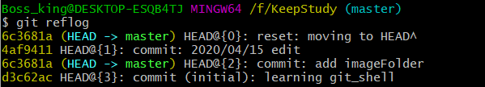

## 1.创建版本库

```git
$ git init
```

## 1.2.把文件添加到仓库中

#### 1.2.1 往仓库添加文件

```git
$ git add readme.txt
```

#### 1.2.2 提交文件到仓库中

```git
$ git commit -m "wrote a readme file"
```

- 简单解释一下`git commit`命令，`-m`后面输入的是本次提交的说明，可以输入任意内容，当然最好是有意义的，这样你就能从历史记录里方便地找到改动记录。

- 为什么Git添加文件需要`add`，`commit`一共两步呢？因为`commit`可以一次提交很多文件，所以你可以多次`add`不同的文件.

#### 1.3 小结

- 初始化一个Git仓库，使用`git init`命令。

- 添加文件到Git仓库，分两步：


- 使用命令`git add `，注意，可反复多次使用，添加多个文件；
- 使用命令`git commit -m `，完成。

## 2. 版本回退

- ​	在实际工作中，我们脑子里怎么可能记得一个几千行的文件每次都改了什么内容，不然要版本控制系统干什么。版本控制系统肯定有某个命令可以告诉我们历史记录，在Git中，我们用`git log`命令查看。

#### 2.1 git log


```git
$ git log

```

- `	
- git log`命令显示从最近到最远的提交日志，我们可以看到3次提交，最近的一次是`append GPL`，上一次是`add distributed`，最早的一次是`wrote a readme file`。
- 如果嫌输出信息太多，看得眼花缭乱的，可以试试加上`--pretty=oneline`参数：


```git
$ git log --pretty=oneline
```

- 首先，Git必须知道当前版本是哪个版本，在Git中，用`HEAD`表示当前版本，也就是最新的提交`1094adb...`（注意我的提交ID和你的肯定不一样），上一个版本就是`HEAD^`，上上一个版本就是`HEAD^^`，当然往上100个版本写100个`^`比较容易数不过来，所以写成`HEAD~100`。
- 尝试将当前版本回退到上一个版本，就可以使用```git reset```命令

#### 2.2 git reset

- ```git
  $ git reset --hard HEAD^
  ```

- Git允许我们在版本的历史之间穿梭，使用命令`git reset --hard commit_id`。

- `HEAD`指向的版本就是当前版本

#### 2.3 git reflog

- ```git
  $ git reflog
  ```

  

- 在Git中，总是有后悔药可以吃的。当你用`$ git reset --hard HEAD^`回退到`add distributed`版本时，再想恢复到`append GPL`，就必须找到`append GPL`的commit id。Git提供了一个命令`git reflog`用来记录你的每一次命令：

#### 2.4 小结

- `HEAD`指向的版本就是当前版本，因此，Git允许我们在版本的历史之间穿梭，使用命令`git reset --hard commit_id`。
- 穿梭前，用`git log`可以查看提交历史，以便确定要回退到哪个版本。
- 要重返未来，用`git reflog`查看命令历史，以便确定要回到未来的哪个版本

## 3. 工作区和暂存区

- Git和其他版本控制系统如SVN的一个不同之处就是有暂存区的概念。

####  3.1 工作区（Working Directory）

- 就是你在电脑里能看到的目录

#### 3.2 版本库

- 工作区有一个隐藏目录`.git`，这个不算工作区，而是Git的版本库。
- Git的版本库里存了很多东西，其中最重要的就是称为stage（或者叫index）的暂存区，还有Git为我们自动创建的第一个分支`master`，以及指向`master`的一个指针叫`HEAD`。
- 前面讲了我们把文件往Git版本库里添加的时候，是分两步执行的：
- 第一步是用`git add`把文件添加进去，实际上就是把文件修改添加到暂存区；
- 第二步是用`git commit`提交更改，实际上就是把暂存区的所有内容提交到当前分支。
- 因为我们创建Git版本库时，Git自动为我们创建了唯一一个`master`分支，所以，现在，`git commit`就是往`master`分支上提交更改。
- 可以简单理解为，需要提交的文件修改通通放到暂存区，然后，一次性提交暂存区的所有修改。

## 4. 管理修改

- 为什么Git比其他版本控制系统设计得优秀，因为Git跟踪并管理的是修改，而非文件。
- Git管理的是修改，当你用`git add`命令后，在工作区的第一次修改被放入暂存区，准备提交，但是，在工作区的第二次修改并没有放入暂存区，所以，`git commit`只负责把暂存区的修改提交了，也就是第一次的修改被提交了，第二次的修改不会被提交.
- 每次修改，如果不用`git add`到暂存区，那就不会加入到`commit`中。

## 5. 撤销修改

#### git checkout -- file

- 假如在修改一份文件时，不小心加入某一行，但是在此之前已经将该文件使用```git add```命令加入暂存区，此时可以使用$ ```git checkout -- readme.txt```  丢弃工作区的修改。 
- 命令`git checkout -- readme.txt`意思就是，把`readme.txt`文件在工作区的修改全部撤销，这里有两种情况：
- 一种是`readme.txt`自修改后还没有被放到暂存区，现在，撤销修改就回到和版本库一模一样的状态；
- 一种是`readme.txt`已经添加到暂存区后，又作了修改，现在，撤销修改就回到添加到暂存区后的状态。
- 总之，就是让这个文件回到最近一次`git commit`或`git add`时的状态。
- 用命令`git reset HEAD `可以把暂存区的修改撤销掉，重新放回工作区：
- `git reset`命令既可以回退版本，也可以把暂存区的修改回退到工作区。当我们用`HEAD`时，表示最新的版本。

#### 5.1 小结

- 又到了小结时间。
- 场景1：当你改乱了工作区某个文件的内容，想直接丢弃工作区的修改时，用命令`git checkout -- file`。
- 场景2：当你不但改乱了工作区某个文件的内容，还添加到了暂存区时，想丢弃修改，分两步，第一步用命令`git reset HEAD `，就回到了场景1，第二步按场景1操作。
- 场景3：已经提交了不合适的修改到版本库时，想要撤销本次提交，参考[版本回退](https://www.liaoxuefeng.com/wiki/896043488029600/897013573512192)一节，不过前提是没有推送到远程库。
- 在最新版中git reset HEAD 可以使用 git restore --staged

## 6. 删除文件

#### 小结

命令`git rm`用于删除一个文件。如果一个文件已经被提交到版本库，那么你永远不用担心误删，但是要小心，你只能恢复文件到最新版本，你会丢失**最近一次提交后你修改的内容**。

## 7.添加远程库

#### 小结

- 首先在github创建仓库

- 然后复制SSH的git地址

- ```git
  $ git remote add origin git@github.com:BossKing-newbie/KeepStudy.git
  ```

- 添加后，远程库的名字就是`origin`，这是Git默认的叫法，也可以改成别的，但是`origin`这个名字一看就知道是远程库。

- 下一步，就可以把本地库的所有内容推送到远程库上

- ```git
  git push -u origin master
  ```

- 

- 把本地库的内容推送到远程，用`git push`命令，实际上是把当前分支`master`推送到远程。

- 由于远程库是空的，我们第一次推送`master`分支时，加上了`-u`参数，Git不但会把本地的`master`分支内容推送的远程新的`master`分支，还会把本地的`master`分支和远程的`master`分支关联起来，在以后的推送或者拉取时就可以简化命令。

- 推送成功后，可以立刻在GitHub页面中看到远程库的内容已经和本地一模一样：

- 

- 从现在起，只要本地作了提交，就可以通过命令：

- ```$ git push origin master```

- 要关联一个远程库，使用命令`git remote add origin git@server-name:path/repo-name.git`；

- 关联后，使用命令`git push -u origin master`第一次推送master分支的所有内容；

- 此后，每次本地提交后，只要有必要，就可以使用命令`git push origin master`推送最新修改；

- 分布式版本系统的最大好处之一是在本地工作完全不需要考虑远程库的存在，也就是有没有联网都可以正常工作，而SVN在没有联网的时候是拒绝干活的！当有网络的时候，再把本地提交推送一下就完成了同步，真是太方便了！
